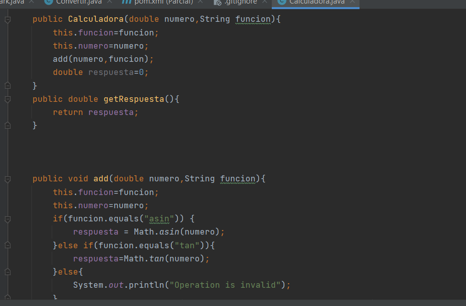
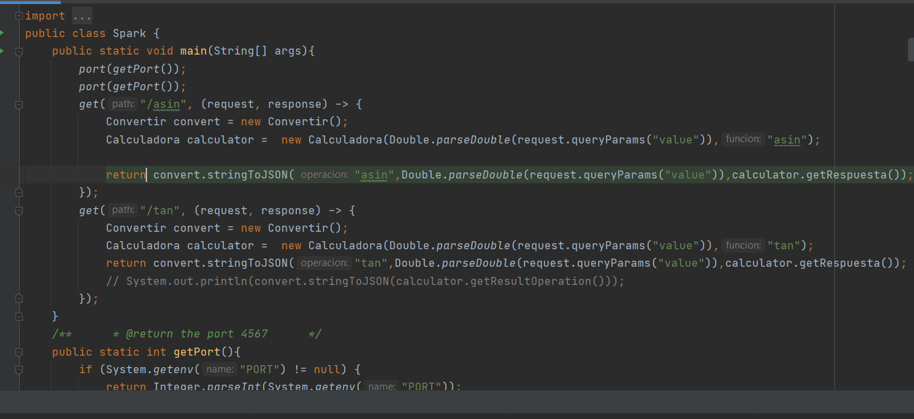
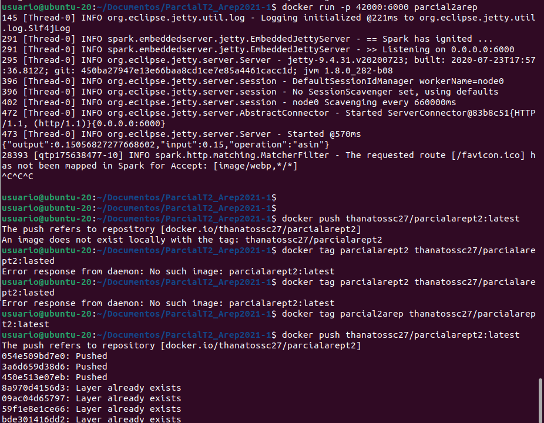
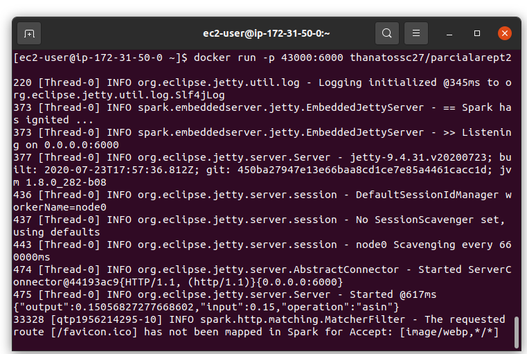
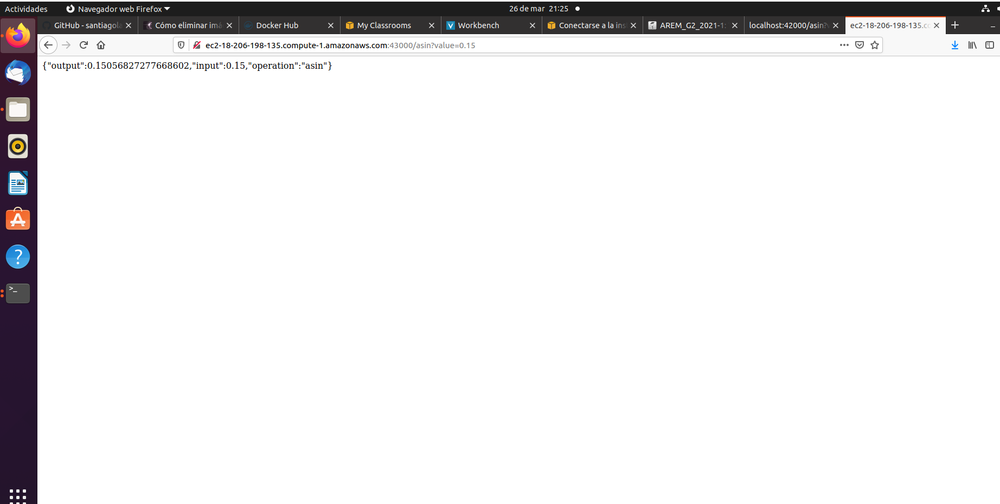

# ParcialT2_Arep2021-1
## 1. Creación del aplicativo web
1. Crea un proyecto utilizando la herramiento de mvn 'mvn archetype:generate -DgroupId=edu.escuelaing.arep.parcial.spark -DartifactId=Spark -DarchetypeArtifactId=maven-archetype-quickstart -DinteractiveMode=false'
   
2. La clase principal
   
   
## 2. Subirlo a docker y a docker
1. Se crean las imagenes y se actualizan en docker hub haciendo docker push al repositorio
   
1. Conectarse a la maquina de aws
   
2. Se pondra en el navegador la direccion de la maquina con el puerto que abrimos y hacemos la petición y no arrojara el resultado
   
   
3. Evidencia del funcionamiento de la aplicación
   
#Creado por:
-Santiago Agustin Laiton Cubides
